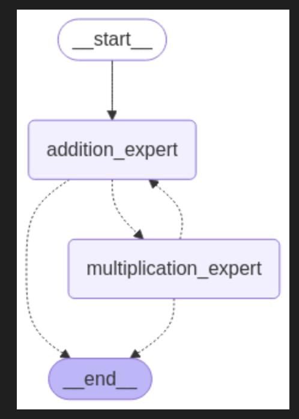

# Multi-Agent Orchestration System - Calculations

## Architecture



The system consists of:

1. **Specialized Agents**:

   - Addition Expert: Specialized in handling addition operations
   - Multiplication Expert: Specialized in handling multiplication operations

2. **Control Flow System**:
   - Uses LangGraph's `StateGraph` to manage transitions between agents
   - Type annotations (`Command[Literal[...]]`) define possible transitions
   - Agents can transfer control to other agents when needed

## Workflow Explanation

The workflow is built using LangGraph's state-based directed graph system:

### Graph Structure and Visualization

1. **Node Definition**:

   - Each node in the graph represents a specific agent/expert function
   - Nodes are defined and added to the graph using `graph.add_node()`
   - Example: `graph.add_node("addition_expert", addition_expert)`

2. **Edge Definition**:

   - Edges represent valid transitions between agents
   - Some edges are explicitly defined: `graph.add_edge(START, "addition_expert")`
   - Other edges are implicitly defined by the return type annotations

3. **Graph Compilation**:
   - The final step is compiling the graph: `app = graph.compile()`
   - This creates an executable workflow application
   - The visualization is generated using `app.get_graph().draw_mermaid_png()`

### Execution Flow

1. **State Initialization**:

   - The workflow begins with an initial state (messages)
   - The state flows through the graph based on agent decisions

2. **Decision Points**:

   - Each agent acts as a decision point in the workflow
   - The agent can choose to:
     - Transfer control to another agent (explicit transition)
     - Complete its work and end the flow (implicit transition to `__end__`)

3. **Edge Types in Visualization**:
   - **Solid Arrows**: Direct transitions that will always occur
   - **Dotted Arrows**: Conditional transitions that may occur based on decisions
   - Without return type annotations, edges don't appear in the visualization

### Dynamic vs. Static Routing

1. **Static Routing**:

   - Defined by the graph structure itself
   - Determines which transitions are possible

2. **Dynamic Routing**:

   - Determined at runtime by agent decisions
   - Agents choose which of the possible transitions to take
   - Based on the context of the current problem

3. **Event-Driven Workflow**:
   - The workflow is event-driven, where tool calls act as events
   - Tool calls trigger state transitions between agents
   - The flow adapts based on the specific needs of the problem

### State Management

1. **Shared State**:

   - The `MessagesState` maintains conversation history across agents
   - Each agent receives the current state and can update it

2. **State Updates**:
   - Updates happen through the `Command` object's `update` parameter:
   ```python
   return Command(
       goto="multiplication_expert",
       update={"messages": [ai_msg, tool_msg]}
   )
   ```
   - This ensures state consistency throughout the workflow

## How It Works

### Core Components

- **MessagesState**: The shared state object passed between agents containing the conversation history
- **Tools**: Simple functions that agents can call to signal transition intentions
- **Command Objects**: Structured objects that specify where to go next and what state updates to make

### Flow Process

1. **Entry Point**:

   - The flow starts at the "addition_expert" node
   - Initial messages are passed to the addition expert

2. **Agent Processing**:

   - Each agent receives the current state with messages
   - The agent processes the input using a specialized system prompt
   - The agent can perform its specialized task

3. **Control Transfer**:

   - If an agent needs help from another agent, it calls a transfer tool
   - The tool call is detected in the agent function
   - A Command object is returned with `goto="{next_agent}"` to transfer control
   - The updated messages are passed to the next agent

4. **Exit Conditions**:
   - If no explicit transfer is requested, the flow moves to `__end__`
   - This happens when the task is completed

## Technical Details

### Type Annotations Drive the Graph

The return type annotations are crucial for visualizing and enforcing the graph structure:

```python
def addition_expert(state: MessagesState) -> Command[Literal["multiplication_expert", "__end__"]]:
    # Function body
```

This annotation explicitly declares that the `addition_expert` can only transition to either:

- The multiplication expert
- The end state

Similarly:

```python
def multiplication_expert(state: MessagesState) -> Command[Literal["addition_expert", "__end__"]]:
    # Function body
```

These annotations are used by LangGraph to build the visual representation of the agent workflow.

### Tool Calls and Responses

When an agent wants to transfer control, it calls a tool:

```python
@tool
def transfer_to_multiplication_expert():
    """
    Transfer the control to the multiplication expert
    """
    return
```

The tool itself doesn't need to do any work - it's just a signaling mechanism. The actual transfer logic is in the agent function:

```python
if len(ai_msg.tool_calls) > 0:
    tool_call_id = ai_msg.tool_calls[-1]["id"]
    tool_msg = {
        "role": "tool",
        "content": "Successfully Transferred",
        "tool_call_id": tool_call_id,
    }

    return Command(
        goto="multiplication_expert",
        update={"messages": [ai_msg, tool_msg]}
    )
```
